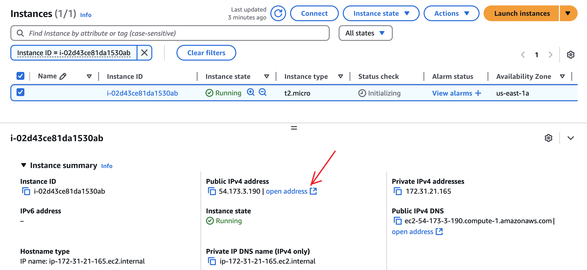

## Creating an EC2 Instance

### Project Overview

#### Purpose

This project provides a step-by-step guide for setting up an Amazon EC2 instance, which serves as a cloud-based Linux server. By following this guide, users will learn how to launch, configure, and access an EC2 instance on AWS, supporting cloud-based development, hosting, and server management.

#### Requirements

The setup includes the following:

- Cloud Computing Environment:

  - Amazon Web Services (AWS) account

  - Amazon EC2 instance setup

- Server Configuration:

    - Secure Shell (SSH) access setup

    - Elastic IP configuration (optional)

- Software Management:

    - Updating and installing necessary packages on the server


### Use Case

This guide is designed for developers, DevOps engineers, and cloud computing enthusiasts who need a scalable and secure Linux server in the cloud. By setting up an EC2 instance, users can:

- Deploy and manage cloud-based applications.

- Remotely access and configure a Linux server.

- Host websites and services with AWS infrastructure.

### 1. Creating an AWS EC2 Instance

#### Steps to Launch an EC2 Instance

1. Sign in to AWS Console:

- Navigate to AWS Console.

- Log in to your AWS account.

2. Open EC2 Dashboard:

- In the AWS Management Console, search for EC2.

- Click Instances > Launch Instance.


3. Choose an Amazon Machine Image (AMI):

- Select Amazon Linux 2 or Ubuntu 20.04 as the preferred AMI.

4. Choose an Instance Type:

- Select t2.micro (eligible for free tier) or a suitable instance type based on your needs.

Configure Instance Details:

- Leave default settings or adjust based on network and availability zone preferences.

5. Add Storage:

- Default 8GB root volume is sufficient, but you can modify storage based on requirements.

6. Configure Security Group:

- Allow SSH (port 22) from your IP for secure access.

- (Optional) Allow HTTP (port 80) and HTTPS (port 443) if hosting a website.

7. Create or Select an SSH Key Pair:

- Select Create a new key pair or Use an existing key pair.

- Download the .pem file and store it securely.


8. Launch the Instance:

- Click Launch Instance and wait for the status to change to "Running".


#### Troubleshooting

- Cannot connect via SSH? Ensure that port 22 is open in the security group.

- Instance not launching? Check AWS region settings and instance limits.

### 2. Connecting to EC2 via SSH

#### Steps to Connect to EC2 Instance

1. Find Public IP:

- In the EC2 dashboard, select the running instance and note the Public IPv4 Address.
 

- Set Permissions for SSH Key:

2. Run the following command in your terminal:

```chmod 400 your-key.pem```

3. Connect Using SSH:

Use the following command:

```ssh -i your-key.pem ec2-user@your-public-ip```

For Ubuntu instances, use:

```ssh -i your-key.pem ubuntu@your-public-ip```

#### Troubleshooting

- Permission denied? Ensure the key has correct permissions (chmod 400 your-key.pem).

- Host unreachable? Verify that your instance is running and security groups allow SSH access.

### 3. Configuring the EC2 Instance

- Update System Packages

Run the following commands after connecting to the instance:

```sudo yum update -y # For Amazon Linux```
```sudo apt update -y   # For Ubuntu```

- Install Common Utilities

```sudo yum install -y git wget unzip```
```sudo apt install -y git wget unzip```
```sudo yum install tree```
```sudo apt install tree```


#### Troubleshooting

Packages not installing? Check internet connectivity from the instance.

Web server not accessible? Ensure security group allows HTTP/HTTPS traffic.

### Conclusion

By following these steps, you have successfully created, connected to, and configured an AWS EC2 instance. This Linux server can now be used for hosting applications, managing cloud-based workloads, and running development environments. Ensuring security and proper configurations will help maintain a reliable cloud-based server setup.

